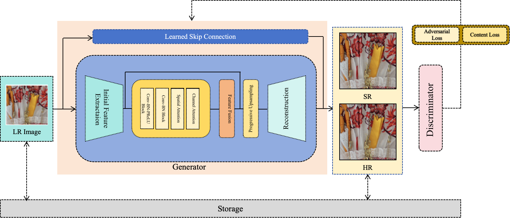
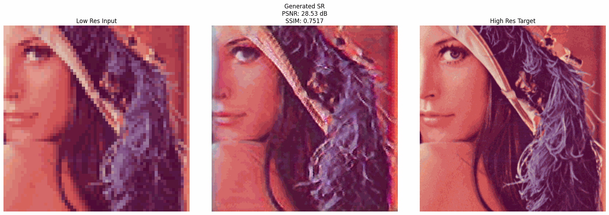
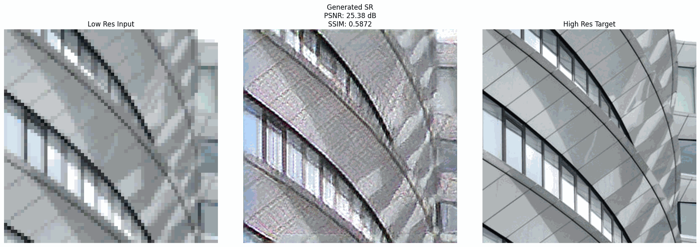
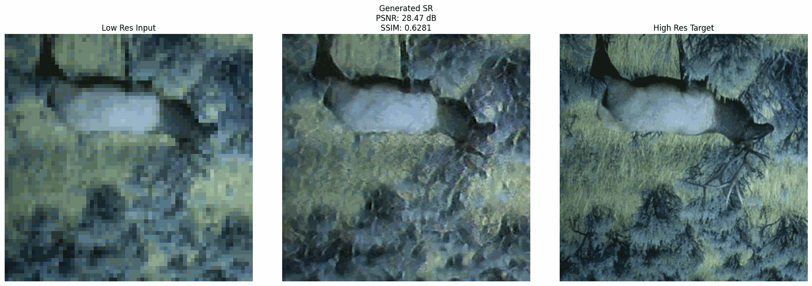
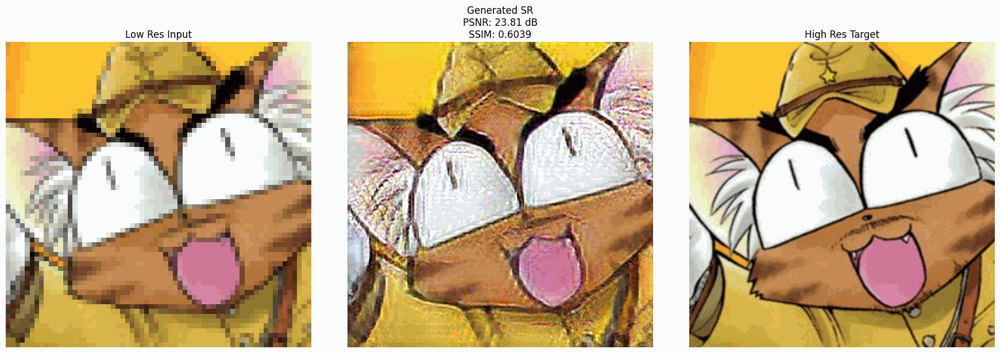

# 🚀 SCAttNet: Dual Attention Network for Image Super-Resolution 🔍✨  
*Author: Anthony*

## 📥 Download the Notebook & Trained Model

Get started with cutting-edge super-resolution effortlessly! This repository provides everything you need: a walkthrough Jupyter Notebook and a pretrained model. Start experimenting, enhance your images, and explore the power of **dual attention** mechanisms.

### 📖 Jupyter Notebook:
[Access the notebook](https://drive.google.com/file/d/1uwmyMCoXayzm6EgTMbt-U-ujJks3fPYe/view?usp=sharing)

### 💻 Trained Model:
[Download the trained model (`model.pth`)](https://drive.google.com/drive/folders/1n_CiytoVxQnah6B-xmSN1F1FFRvWYsFV?usp=drive_link)

---

## 🔧 Model Architecture Overview



---

## 🌟 What Makes This Model Stand Out?

- 🧠 **Dual Attention Mechanism for Super-Resolution**  
  Combines **Channel Attention** and **Spatial Attention** to adaptively refine features and preserve fine textures—delivering sharper and clearer super-resolution outputs.

- ⚡ **Progressive Upsampling for High Fidelity**  
  Achieve **4× super-resolution** with a lightweight, multi-stage upsampling pipeline designed for quality without sacrificing speed.

- 🎯 **Dataset Flexibility**  
  Train and evaluate the model on **DIV2K**, **Urban100**, **Manga109**, and more.

- 📊 **Comprehensive Evaluation Metrics**  
  Analyze performance using **PSNR**, **SSIM**, and **VGG perceptual loss**.

- 🚀 **One-Command Training Flow**  
  Launch end-to-end training with a single command—streamlined for both researchers and practitioners.

---

## 🛠️ Quick Start

### 1. Installation
```bash
conda create -n dualsr python=3.9 -y
conda activate dualsr
pip install -r requirements.txt
```
### 2. **Download Datasets (Auto-downloader included!)**
Get all the datasets for training and testing in one go:

```bash
python download_data.py
```
### 3. **Train the Model**
Ready to train? Simply execute:
```bash
python main.py
```
### 4. **Test on Your Own Images**
Want to upscale your own images? Here’s how you can do it:
```bash
from model import SuperResolutionNet

# Load pretrained model
model = SuperResolutionNet().load_from_checkpoint("model.pth")

# Upscale your image
enhanced_image = model.upscale("your_image.jpg")
```
**🚀 Unlock the Power of Image Super-Resolution!**  
Transform low-resolution images into stunning high-resolution masterpieces with our state-of-the-art PyTorch model, powered by a revolutionary triple attention mechanism. Watch as every detail comes to life, and experience clarity like never before! ✨

👀 **See the Magic in Action!**  
Here’s a sneak peek at how our model enhances images—witness the incredible transformation as blurry, low-res images turn into crisp, high-res versions:

  
  
  
  
  

*(The examples above are just a glimpse! Replace these placeholders with your own mind-blowing results.)*

---

## 🏗️  **Architecture Overview**
Innovative Components:
| Component                        | Description                                                                                      |
|-----------------------------------|--------------------------------------------------------------------------------------------------|
| 🔄 Residual Attention Blocks      | Integrating residual learning with attention mechanisms for robust feature mapping.              |
| 🎛️ Channel-Spatial Attention Fusion | A powerful fusion of channel and spatial attention to adaptively enhance features.               |
| 🏗️ Learned Skip Connections       | Skip connections that are optimized during training to ensure more effective learning.           |
| ⚖️ GAN-Based Training             | Leverage the power of Generative Adversarial Networks for more realistic and sharper results.     |


## 📈  **Performance**

Here’s how SCAttNet stacks up across different datasets:


| Dataset         | Bicubic          | SRCNN           | MemNet          | EDSR            | RDN             | RCAN            | RRDB ESRGAN     |SCAttNet|
|-----------------|------------------|-----------------|-----------------|-----------------|-----------------|-----------------|-----------------|-------------------------------------------|
| **Set14**       | 26.00/0.7027     | 27.50/0.7513    | 28.26/0.7723    | 28.80/0.7876    | 28.81/0.7871    | 28.87/0.7889    | 28.88/0.7896     | **29.18/0.7712** |
| **BSD100**      | 25.96/0.6675     | 26.90/0.7101    | 27.40/0.7281    | 27.71/0.7420    | 27.72/0.7419    | 27.77/0.7436    | 27.76/0.7432    | **28.71/0.7015** |
| **Urban100**    | 23.14/0.6577     | 24.52/0.7221    | 25.50/0.7630    | 26.64/0.8033    | 26.61/0.8028    | 26.82/0.8087    | 26.73/0.8072    | **27.99/0.7209** |
| **Manga109**    | 24.89/0.7866     | 27.58/0.8555    | 29.42/0.8942    | 31.02/0.9148    | 31.00/0.9151    | 31.22/0.9173    | 31.16/0.9164    | **27.33/0.7765** |

